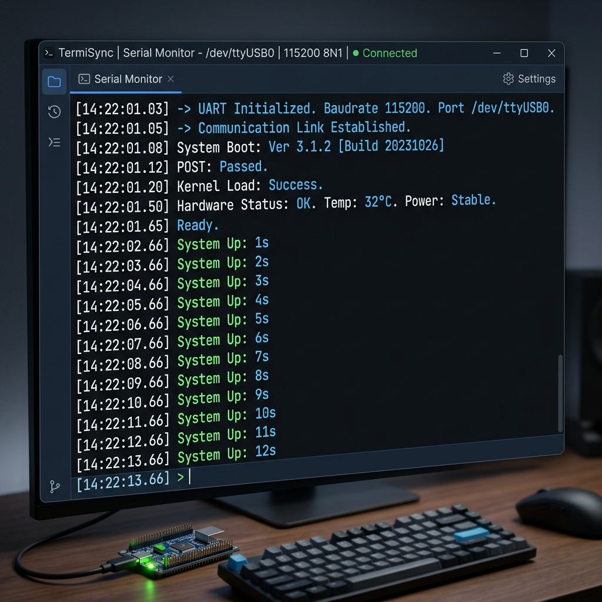

# 通聯診斷報告 (Diagnostic Report)

本報告用於記錄硬體通聯測試的過程與結果。

## 1. 基礎環境資訊
*   **作業系統版本**：(例如: Windows 11, macOS Sonoma 14.2)
*   **橋接晶片型號**：(例如: CP2102, CH340, FT232R)
*   **分配到的 COM/tty 埠號**：(例如: COM3, /dev/tty.usbserial-110)

## 2. 亂碼解密實驗 (Task 2)
*   **預期速率**：115200
*   **初始設定速率**：9600
*   **現象描述**：(描述在 9600 速率下看到的畫面)
*   **成因解釋**：

## 3. Loopback 自我對話測試 (Task 3)
*   **測試引腳**：短路 `TX` 與 `RX`
*   **測試工具**：(例如: Arduino IDE Serial Monitor, PlatformIO Serial Monitor)
*   **測試結果**：
    *   [ ] 輸入文字後，螢幕是否成功顯示相同的回傳文字 (Echo)？
*   **診斷結論**：此測試成功代表從「電腦到橋接晶片」這條鏈路是健康的。

## 4. 驗證截圖
請將截圖存放在 `assets/` 資料夾，並在此引用：
*   **裝置管理員/終端機偵測圖**：
*   **順利接收到的 Serial Data**：
